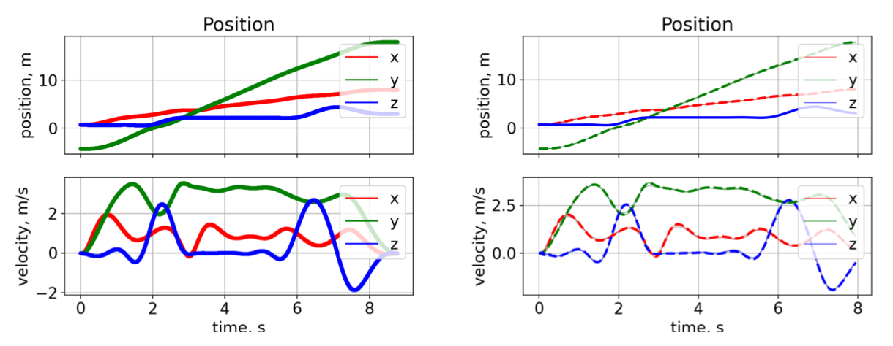
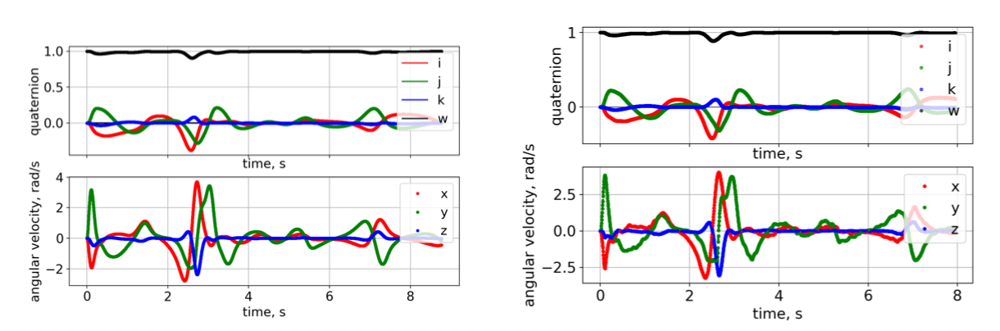

**University of Pennsylvania, MEAM 620: Advanced Robotics,
Project - Autonomous UAV**

* Yilin Li 
* Major: Robotics & CGGT 

## Introduction
This project implemented a Geometric Nonlinear Controller for the quadrotor. It built a trajectory generator for the quadrotor with Dijkstra’s algorithm and Astar Algorithm and applied minimum jerk polynomial segments to smooth trajectories. The tools I used to estimate the poses of the quadrotor by applying Error State Kalman Filter are onboard sensors such as an inertial measurement unit(IMU) and a stereo pair. 

## Video Results
Maze: 

https://user-images.githubusercontent.com/38061240/219240829-92098e61-bf27-4734-9161-39c20e01c529.mov

Window: 

https://user-images.githubusercontent.com/38061240/219241053-cb1bf9a1-8a4e-4d5c-bf28-de7c9ee65de3.mov

Over and Under: 

https://user-images.githubusercontent.com/38061240/219241129-7a4cde59-78bd-43a3-8ffb-5408294612a1.mov

Evaluating controller in real quadrotor:

https://user-images.githubusercontent.com/38061240/219244558-4f2ef54f-2ec6-4803-ae0f-a81ae25e8c46.mp4

## Image Results

The following images are important image results by running my algorithm on the Maze map. 

## Compare with quadrotor given true states

For two figures above, the left figures used true states of the quadrotor and right figures used the VIO to estimate the states of the quadrotor. Notice that the overall position and velocity are similar no matter whether the true states are given or estimated. The only difference is that the estimated states are more noisy than the true states which is the nature of state estimation by kalman filters. 

