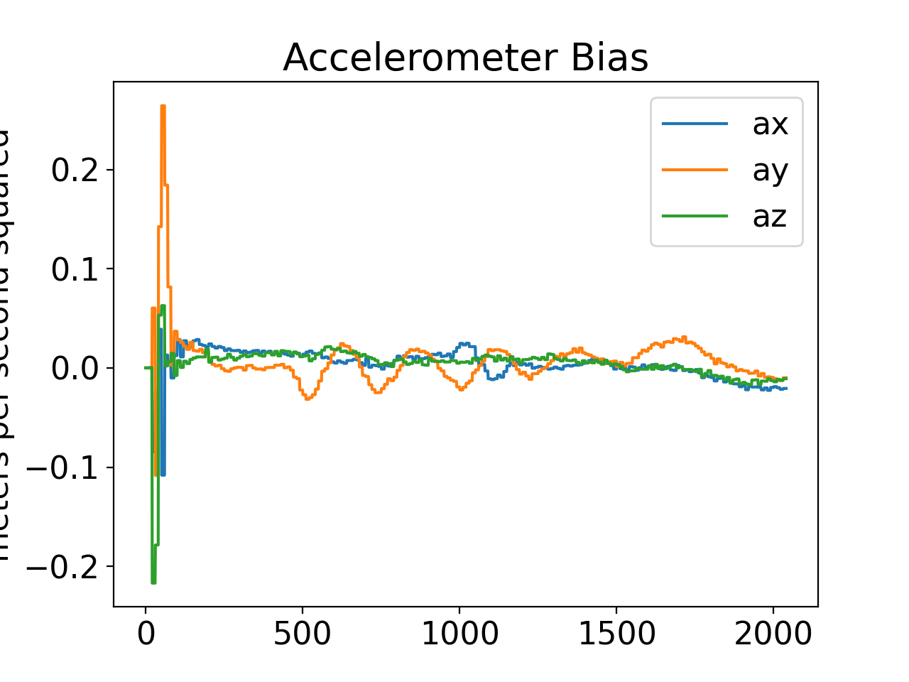

**University of Pennsylvania, MEAM 620: Advanced Robotics,
Project - Autonomous UAV**

* Yilin Li 
* Major: Robotics & CGGT 

## Introduction
This project implemented a Geometric Nonlinear Controller for the quadrotor. It built a trajectory generator for the quadrotor with Dijkstra’s algorithm and Astar Algorithm and applied minimum jerk polynomial segments to smooth trajectories. The tools I used to estimate the poses of the quadrotor by applying Error State Kalman Filter are onboard sensors such as an inertial measurement unit(IMU) and a stereo pair. 

## Video Results
Maze: 

https://user-images.githubusercontent.com/38061240/219240829-92098e61-bf27-4734-9161-39c20e01c529.mov

Window: 

https://user-images.githubusercontent.com/38061240/219241053-cb1bf9a1-8a4e-4d5c-bf28-de7c9ee65de3.mov

Over and Under: 

https://user-images.githubusercontent.com/38061240/219241129-7a4cde59-78bd-43a3-8ffb-5408294612a1.mov

## Image Results

The following images are important image results by running my algorithm on the Maze map. 

